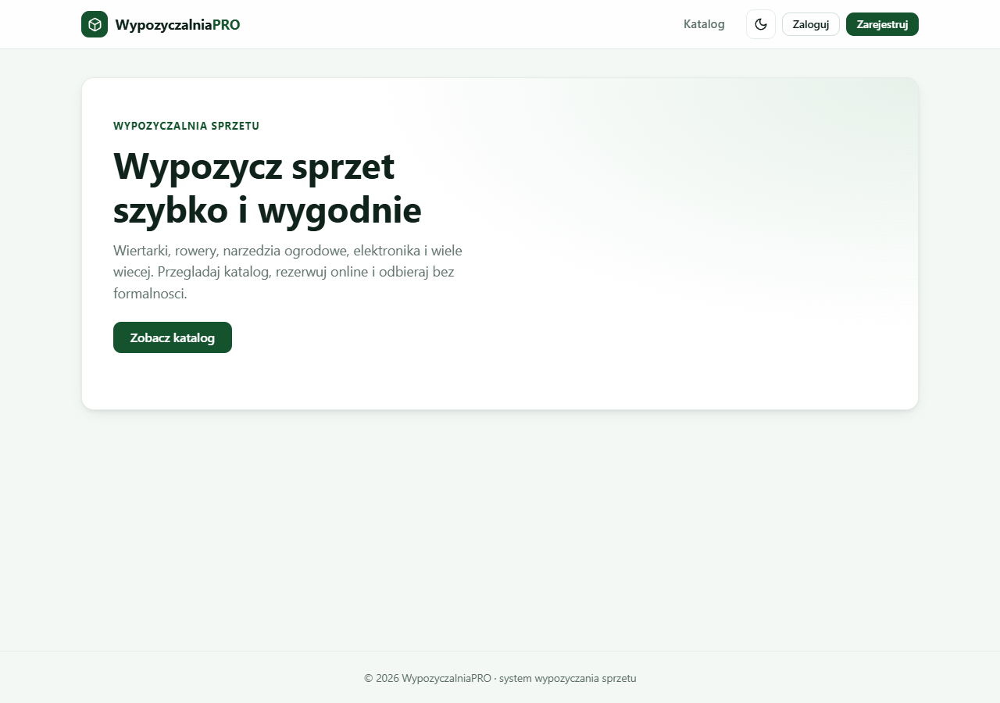
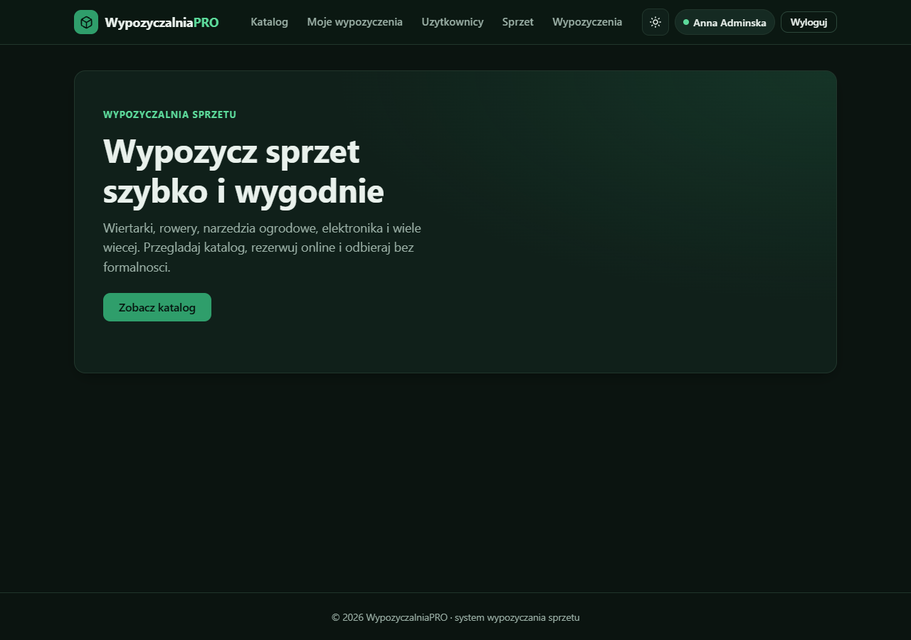
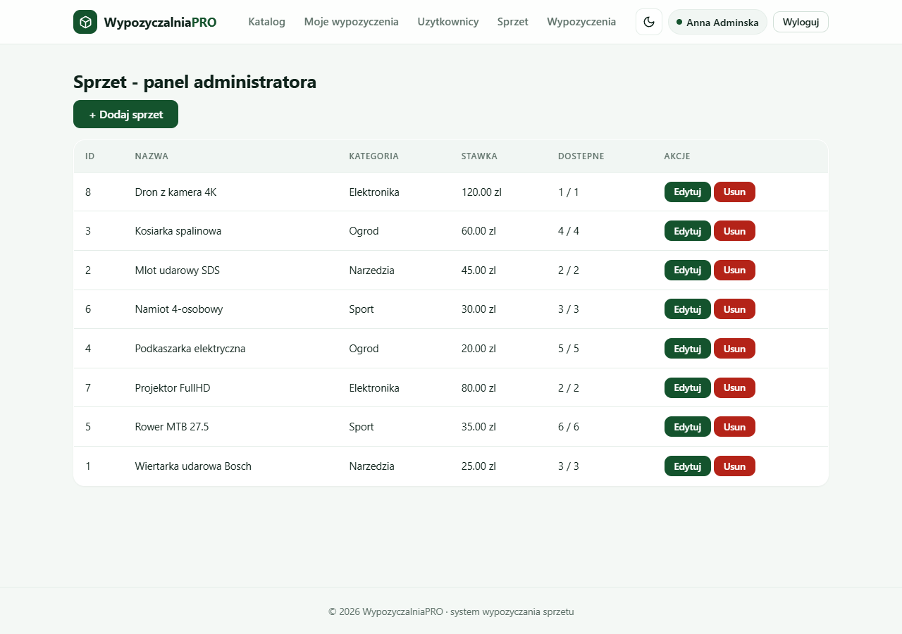
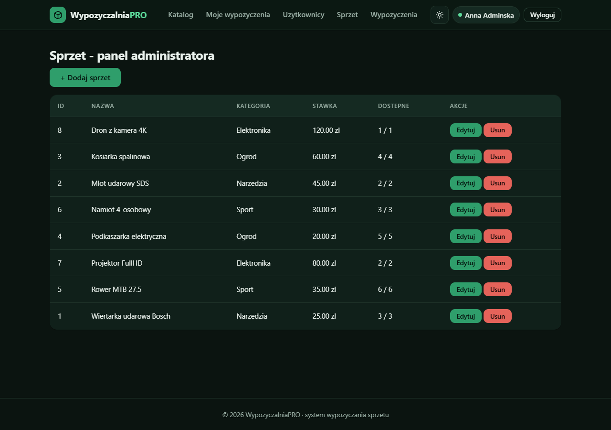

# WypozyczalniaPRO

Aplikacja webowa do obslugi wypozyczalni sprzetu (narzedzia, ogrod, sport,
elektronika). Projekt realizowany w ramach przedmiotu WdPAI.

## Stack technologiczny

- **PHP 8.2** obiektowo, bez frameworka, autoloader PSR-4 wlasny
- **PostgreSQL 15** (widoki, trigger, funkcja PL/pgSQL, transakcje SERIALIZABLE)
- **HTML5 + CSS** (media queries, brak gotowych szablonow)
- **JavaScript** + **FETCH API** (dynamiczne wyszukiwanie w katalogu)
- **Docker / docker-compose** (PHP-FPM, PostgreSQL, nginx)
- **PHPUnit** + bashowy smoke test

## Architektura

Klasyczny MVC z dodatkowa warstwa **Service** (logika biznesowa) i **Repository**
(dostep do bazy). Middleware obsluguje uwierzytelnienie i autoryzacje.

```
[nginx] -> public/index.php (front controller)
         -> Router -> [Middleware] -> Controller
                                       |-> Service -> Repository -> PDO -> Postgres
                                       |-> View (renderowane szablony PHP)
```

Zasady SOLID:
- SRP: kontrolery cienkie, logika w Service, dostep do bazy w Repository
- OCP: bazowe klasy `AbstractController`, `AbstractRepository`
- LSP/DIP: serwisy przyjmuja repozytoria w konstruktorze (mockowalne w testach)
- ISP: male, dedykowane klasy (Session, Request, Response, View)

## Uruchomienie

```bash
cp .env.example .env
docker-compose up -d --build
```

Aplikacja dostepna pod `http://localhost:8080`.

Baza danych jest inicjalizowana z plikow w `database/` automatycznie przez
Postgresa (volume `docker-entrypoint-initdb.d`). Reczna instalacja:

```bash
psql -U app -d wypozyczalnia -f database/install.sql
```

## Konta testowe

| Email                | Haslo         | Rola      |
|----------------------|---------------|-----------|
| admin@wpro.pl        | admin123      | admin     |
| pracownik@wpro.pl    | pracownik123  | pracownik |
| klient@wpro.pl       | klient123     | klient    |

## Baza danych

### Tabele i relacje

| Tabela            | Typ relacji                   |
|-------------------|-------------------------------|
| `users`           | -                             |
| `user_profiles`   | 1:1 z `users`                 |
| `categories`      | -                             |
| `equipment`       | 1:N z `categories`            |
| `equipment_images`| 1:N z `equipment`             |
| `rentals`         | 1:N z `users`                 |
| `rental_items`    | M:N (`rentals` <-> `equipment`) z atrybutami `quantity`, `daily_rate` |

ERD: [`docs/erd.svg`](docs/erd.svg) (zrodlo edytowalne: [`docs/erd.drawio`](docs/erd.drawio),
opis tekstowy: [`docs/erd.md`](docs/erd.md)).

### Widoki, trigger, funkcja

- `v_active_rentals` - aktywne wypozyczenia z JOIN po 4 tabelach
- `v_popular_equipment` - ranking popularnosci sprzetu (JOIN + GROUP BY)
- trigger `rental_items_after_insert` -> `trg_decrement_available()`
  automatycznie zmniejsza `equipment.available_quantity` po dodaniu pozycji
- funkcja `fn_calculate_rental_cost(equipment_id, quantity, days)` zwraca koszt
- tworzenie wypozyczenia: `SET TRANSACTION ISOLATION LEVEL SERIALIZABLE`
- akcje FK: `ON UPDATE CASCADE` + `ON DELETE RESTRICT/CASCADE` (zalezne od relacji)

Baza jest w 3 postaci normalnej - kazda kolumna zalezy od PK (cena dzienna jest
kopiowana do `rental_items.daily_rate`, bo dotyczy momentu wypozyczenia,
a nie aktualnej ceny, wiec nie jest redundancja).

## Funkcjonalnosci

- Rejestracja / logowanie / wylogowanie (sesja, regeneracja id, samesite=Lax)
- Role: **admin**, **pracownik**, **klient** (RoleMiddleware)
- Klient: katalog, szczegoly, wypozyczenie, zwrot, historia "Moje wypozyczenia"
- Pracownik: lista wszystkich wypozyczen, oznaczenie zwrotu
- Admin: zarzadzanie uzytkownikami (zmiana roli, usuwanie), CRUD sprzetu,
  upload obrazkow
- Dynamiczne wyszukiwanie sprzetu przez FETCH API (`/api/equipment`)
- Strony bledow 400/403/404/500 obslugiwane globalnie (`ErrorHandler`)
- Minimalistyczny design (biel + ciemna zielen) z trybem jasnym/ciemnym
  (przelacznik w naglowku, zapamietywanie w `localStorage`, `prefers-color-scheme`)

## Scenariusz testowy

1. `docker-compose up -d --build`
2. Otworz `http://localhost:8080` -> strona glowna
3. Zaloguj sie jako klient `klient@wpro.pl` / `klient123`
4. Przejdz do **Katalog**, wpisz "wiertarka" - lista odswieza sie przez fetch
5. Kliknij szczegoly -> **Wypozycz**, wybierz daty, zatwierdz
6. **Moje wypozyczenia** -> sprawdz wpis -> kliknij **Zwroc**
7. Wyloguj i zaloguj jako `admin@wpro.pl` / `admin123`
8. **Uzytkownicy** - zmien role wybranemu uzytkownikowi
9. **Sprzet** -> Dodaj nowy sprzet -> dodaj obrazek
10. Otworz w incognito `http://localhost:8080/admin/users` bez logowania -> 302
    na `/login` (AuthMiddleware) lub 403 dla zalogowanego klienta (RoleMiddleware)
11. Sprawdz widoki bazy:
    ```sql
    SELECT * FROM v_active_rentals;
    SELECT * FROM v_popular_equipment LIMIT 5;
    SELECT fn_calculate_rental_cost(1, 2, 3);
    ```

## Testy

- **Jednostkowe** (PHPUnit) - 11 testow, 18 asercji:
  ```bash
  composer install
  vendor/bin/phpunit            # lub: docker compose exec php vendor/bin/phpunit
  ```
  Pokrywaja `User` (model), `AuthService` (mock UserRepository),
  `LoginThrottle` (mock LoginAttemptRepository) oraz `Csrf`.
- **Integracyjne** (curl):
  ```bash
  bash tests/integration/smoke.sh
  ```
  Sprawdza m.in. odrzucenie POST `/login` bez tokenu CSRF (403).

## Bezpieczenstwo (Security Bingo)

Aplikacja realizuje 24 z 25 punktow "Security Bingo". Jedyny celowo
**niezaimplementowany** punkt to **E1 (wymuszenie HTTPS)** - aplikacja jest
uruchamiana lokalnie po HTTP, a wsparcie dla flagi `Secure` na cookie jest
przygotowane i wlaczane zmienna `SESSION_SECURE=true` w srodowisku z HTTPS.

| #  | Zabezpieczenie | Status | Gdzie w kodzie |
|----|----------------|--------|----------------|
| A1 | Ochrona przed SQL injection (prepared statements) | ✅ | wszystkie repozytoria (PDO `prepare`/bind) |
| B1 | Nie zdradzam, czy email istnieje | ✅ | `AuthController::login` ("Email lub haslo jest niepoprawne") |
| C1 | Walidacja formatu email po stronie serwera | ✅ | `AuthService::validate` (`filter_var`) |
| D1 | UserRepository jako singleton | ✅ | `UserRepository::getInstance` |
| E1 | Logowanie/rejestracja tylko przez HTTPS | ⬜ | celowo pominiete; przygotowane `SESSION_SECURE` |
| A2 | Login/register tylko POST, GET renderuje | ✅ | `Router` (405 dla zlej metody) + osobne trasy GET/POST |
| B2 | CSRF token w formularzu logowania | ✅ | `Csrf::field` + `CsrfMiddleware` |
| C2 | CSRF token w formularzu rejestracji | ✅ | `Csrf::field` + `CsrfMiddleware` |
| D2 | Ograniczenie dlugosci wejscia | ✅ | `AuthService::validate` (limity) + `maxlength` w formularzach |
| E2 | Hasla jako hash (bcrypt) | ✅ | `AuthService::register` (`password_hash`) |
| A3 | Hasla nigdy nie trafiaja do logow | ✅ | `LoginThrottle` loguje tylko email+IP; `ErrorHandler` nie zrzuca POST |
| B3 | Regeneracja ID sesji po logowaniu | ✅ | `Session::login` (`session_regenerate_id(true)`) |
| C3 | Cookie sesyjne HttpOnly | ✅ | `Session::start` (`cookie_httponly`) |
| D3 | Cookie sesyjne Secure | ✅ | `Session::start` (`cookie_secure` z `SESSION_SECURE`) |
| E3 | Cookie SameSite | ✅ | `Session::start` (`cookie_samesite = Lax`) |
| A4 | Limit prob logowania / blokada czasowa | ✅ | `LoginThrottle` + tabela `login_attempts` |
| B4 | Walidacja zlozonosci hasla | ✅ | `AuthService::validate` (min 8, litera+cyfra) |
| C4 | Sprawdzenie, czy email juz istnieje | ✅ | `AuthService::register` (`findByEmail`) |
| D4 | Escaping danych w widokach (XSS) | ✅ | `htmlspecialchars(..., ENT_QUOTES)` we wszystkich widokach |
| E4 | Brak stack trace w produkcji | ✅ | `ErrorHandler` (tryb `APP_DEBUG`) |
| A5 | Sensowne kody HTTP (400/401/403/405/429) | ✅ | kontrolery + `Router` + `ErrorHandler` |
| B5 | Haslo nie trafia do widokow | ✅ | kontrolery nie przekazuja hasla do `render` |
| C5 | Z bazy pobieram tylko minimalny zestaw danych | ✅ | `UserRepository::COLUMNS` (jawna lista kolumn) |
| D5 | Poprawne wylogowanie - niszczenie sesji | ✅ | `Session::logout` (czyszczenie + usuniecie cookie) |
| E5 | Audyt nieudanych prob logowania (bez hasel) | ✅ | `LoginThrottle::registerFailure` + `login_attempts` |

### Scenariusz testowy bezpieczenstwa

1. **CSRF**: usun pole `csrf_token` z formularza logowania (DevTools) i wyslij ->
   odpowiedz **403**.
2. **Brute-force**: 5x bledne haslo dla tego samego emaila -> kolejna proba
   blokowana komunikatem i kodem **429**.
3. **Enumeracja**: zaloguj sie z nieistniejacym emailem -> komunikat identyczny
   jak przy zlym hasle.
4. **XSS**: zarejestruj uzytkownika z imieniem `<script>alert(1)</script>` ->
   w widokach wyswietla sie jako tekst, skrypt sie nie wykonuje.
5. **Audyt**: po nieudanych probach sprawdz `SELECT * FROM login_attempts;`.

## Checklista wymagan

- [x] Docker + docker-compose (PHP + Postgres + nginx)
- [x] GIT z historia rozwoju (60+ commitow, rozwoj od marca do czerwca)
- [x] HTML5, CSS, JavaScript (FETCH API)
- [x] PHP obiektowy, bez frameworka
- [x] PostgreSQL
- [x] MVC + Service + Repository + Middleware
- [x] Estetyczny, responsywny UI (media queries 768/480) + tryb jasny/ciemny
- [x] Logowanie, sesja, wylogowanie
- [x] Role i weryfikacja uprawnien w trakcie dzialania
- [x] Zarzadzanie uzytkownikami
- [x] Relacje 1:1, 1:N, M:N
- [x] 2 widoki SQL z JOIN po wielu tabelach
- [x] Trigger PL/pgSQL
- [x] Funkcja PL/pgSQL
- [x] Transakcja SERIALIZABLE przy tworzeniu wypozyczenia
- [x] FK z akcjami CASCADE/RESTRICT
- [x] 3 postacie normalne, brak redundancji
- [x] Eksport bazy do plikow SQL
- [x] README z opisem, ERD, screenami, instrukcja, scenariuszem
- [x] PHPUnit (2 zestawy testow)
- [x] Bashowy smoke test endpointow
- [x] Strony bledow 400/403/404/405/500
- [x] SOLID + brak duplikacji kodu
- [x] Security Bingo: 24/25 punktow (CSRF, throttling, audyt, XSS, sesje, ...)

## Struktura katalogow

```
.
├── database/        # schema.sql, views.sql, triggers.sql, functions.sql,
│   │                # seed.sql, migrations/ (login_attempts)
├── docker/          # Dockerfile PHP, konfiguracja nginx
├── docs/            # ERD, screeny, diagram architektury
├── public/          # front controller, CSS, JS, uploads
├── src/
│   ├── Controllers/ # AbstractController + Home/Auth/User/Equipment/Rental
│   ├── Core/        # Autoloader, Config, Database, Router, Request, Response,
│   │                # View, Session, Csrf, ErrorHandler
│   ├── Middleware/  # AuthMiddleware, RoleMiddleware, CsrfMiddleware
│   ├── Models/      # User, Category, Equipment, Rental
│   ├── Repositories/# AbstractRepository + UserRepo, EquipmentRepo,
│   │                # LoginAttemptRepo, ...
│   └── Services/    # AuthService, RentalService, LoginThrottle
├── tests/
│   ├── Unit/        # UserModelTest, AuthServiceTest, LoginThrottleTest, CsrfTest
│   └── integration/ # smoke.sh
├── views/           # layout.php + szablony PHP
├── docker-compose.yml
├── .env.example
└── phpunit.xml
```

## Diagram warstw

Diagram graficzny: [`docs/architecture.svg`](docs/architecture.svg). Wersja tekstowa:

```
+--------------------+
|  Widoki (PHP/HTML) |  <- prezentacja
+---------+----------+
          |
+---------v----------+
|   Kontrolery       |  <- przyjecie zadania, walidacja prosta
+---------+----------+
          |
+---------v----------+
|     Services       |  <- logika biznesowa, transakcje
+---------+----------+
          |
+---------v----------+
|   Repozytoria      |  <- SQL, PDO
+---------+----------+
          |
+---------v----------+
|   PostgreSQL       |  <- widoki, trigger, funkcja
+--------------------+
```

## Screeny

Zrzuty ekranu w katalogu [`docs/screenshots/`](docs/screenshots) (wygenerowane z
dzialajacej aplikacji w Dockerze). Interfejs jest minimalistyczny, w kolorystyce
**biel + ciemna zielen**, z obsluga **trybu jasnego i ciemnego** (przelacznik w
naglowku, zapamietywany w `localStorage`, respektuje `prefers-color-scheme`).

**Motyw jasny vs ciemny (desktop, 1280px):**

| Tryb jasny | Tryb ciemny |
|---|---|
|  |  |
|  |  |
|  |  |

Dodatkowo: `login.png`, `admin-users.png`, `admin-rentals.png`.

**Wersja mobilna (390px, responsywny uklad jednokolumnowy):**

| Strona glowna (jasny) | Katalog (ciemny) |
|---|---|
|  |  |

Dodatkowo: `mobile-catalog.png`, `mobile-admin-equipment.png`.
