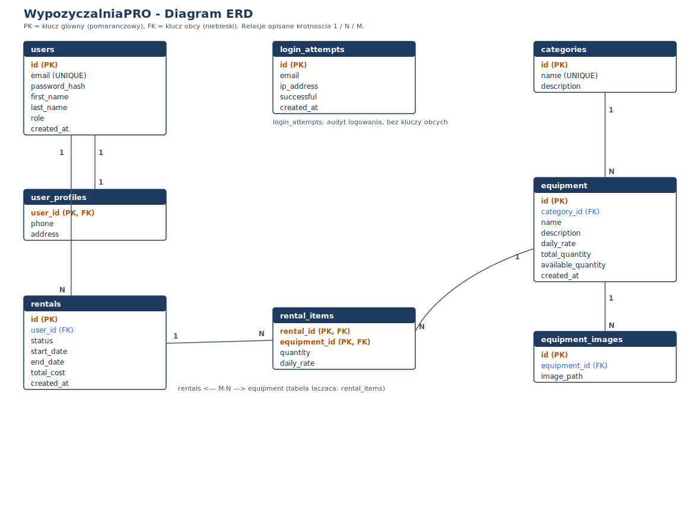
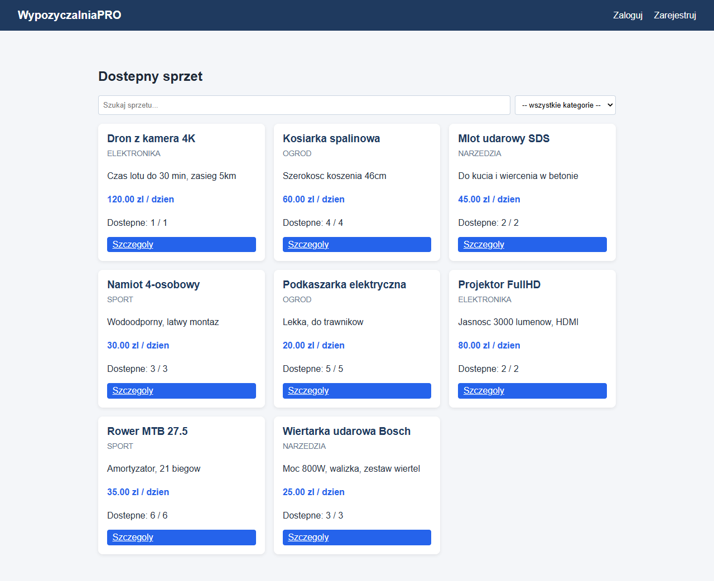
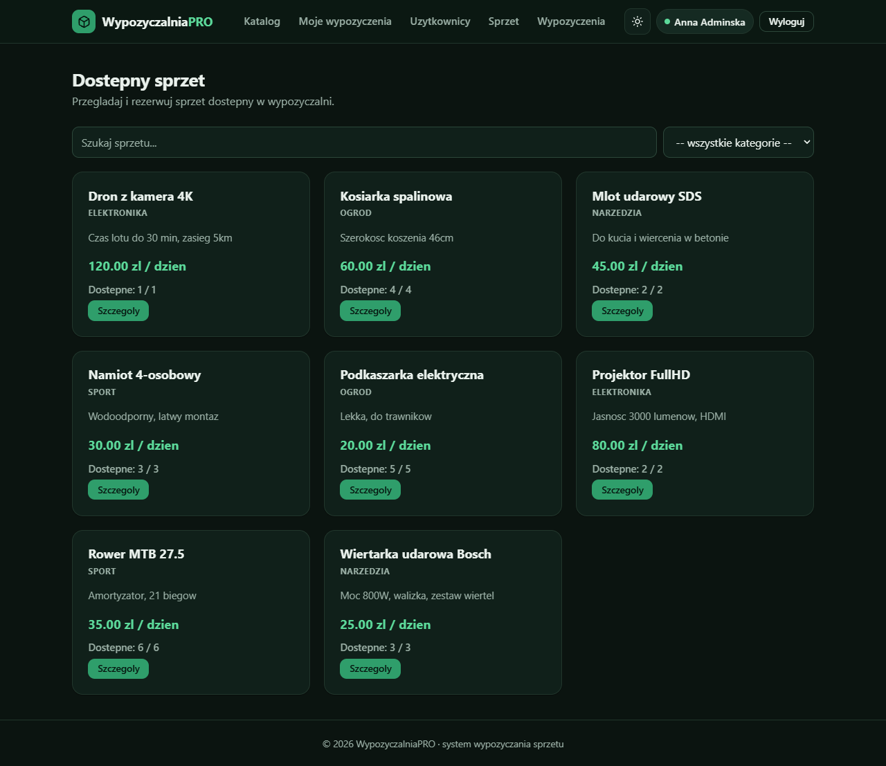
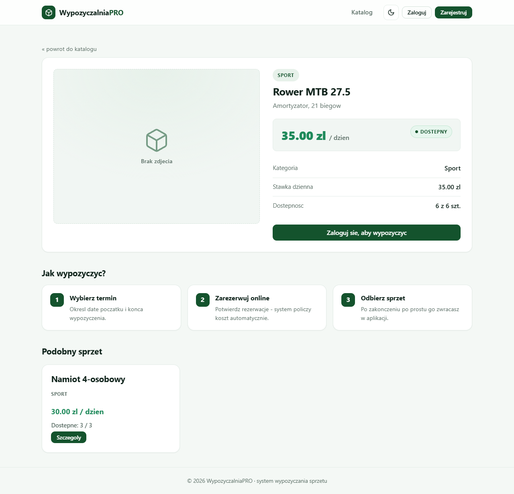
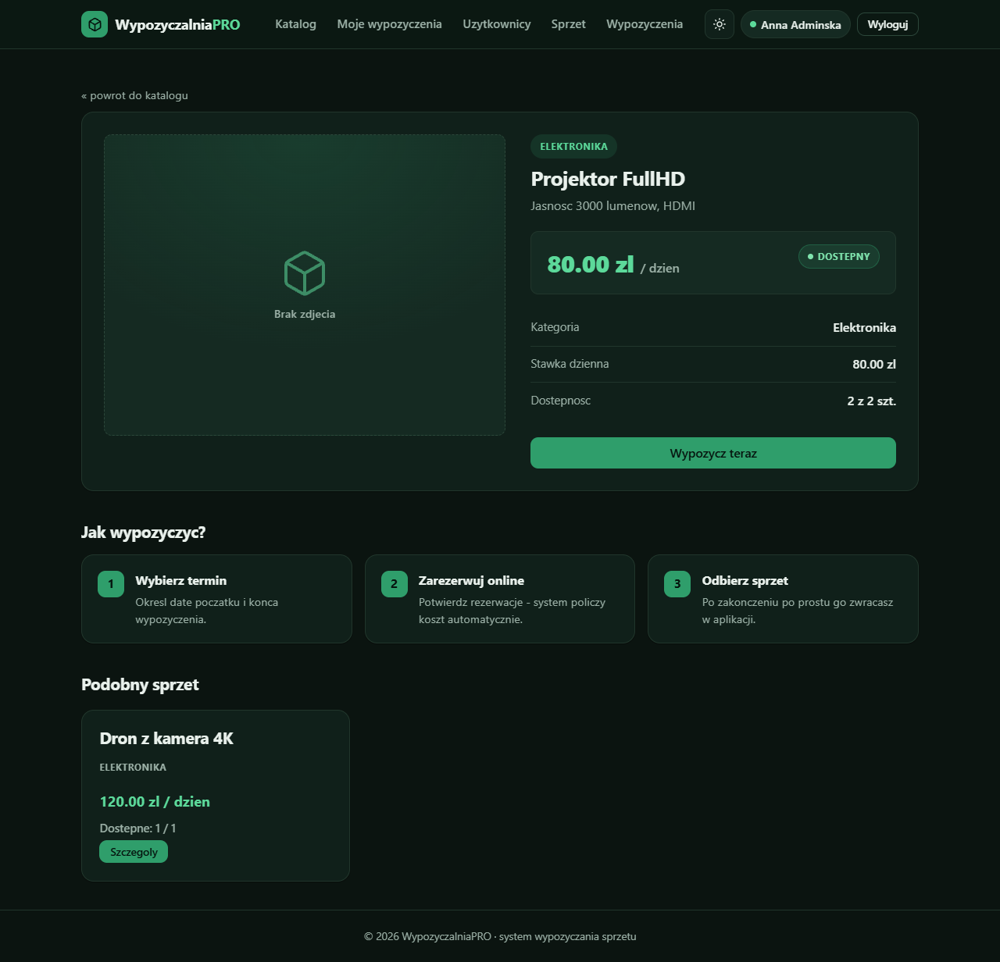
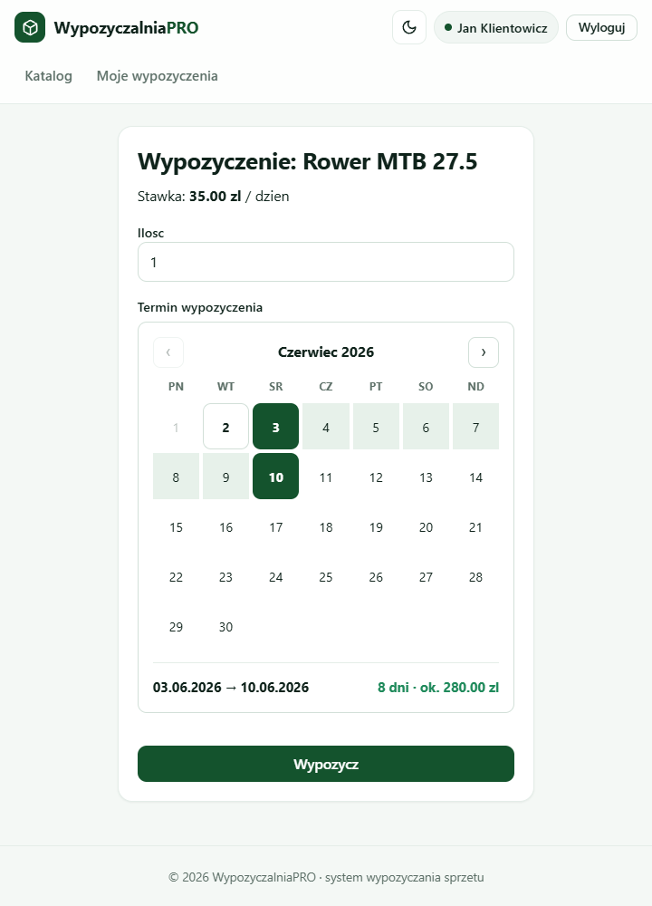
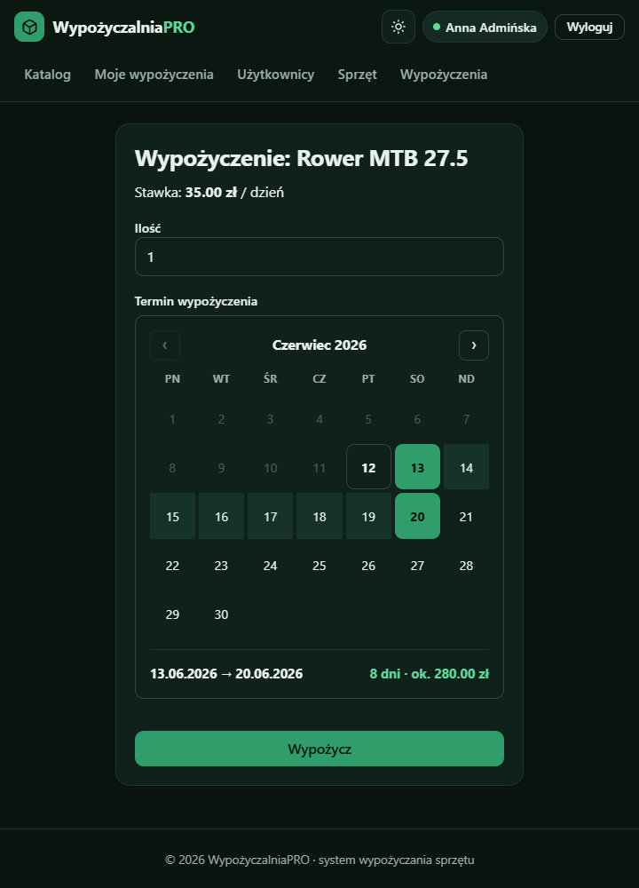
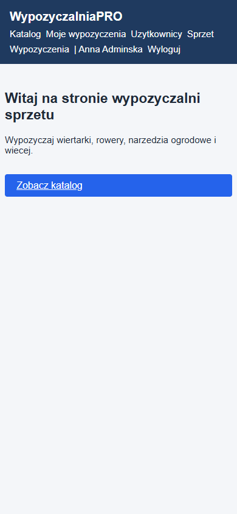
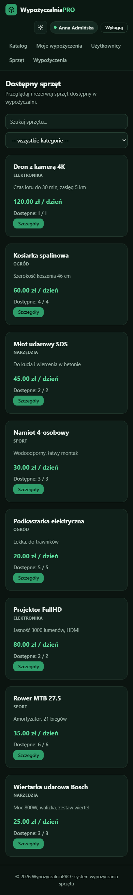

# WypozyczalniaPRO – system wypozyczania sprzetu

> Webowa wypozyczalnia sprzetu (narzedzia, ogrod, sport, elektronika).
> Projekt zaliczeniowy – kurs WdPAI, Politechnika Krakowska.

Minimalistyczny interfejs (biel + ciemna zielen) z trybem jasnym i ciemnym,
zbudowany w czystym PHP 8.2 (OOP, bez frameworka) na PostgreSQL, uruchamiany
jednym poleceniem `docker compose up`.

---

## Spis tresci

1. [Opis aplikacji](#opis-aplikacji)
2. [Technologie i architektura](#technologie-i-architektura)
3. [Instrukcja uruchomienia](#instrukcja-uruchomienia)
4. [Zmienne srodowiskowe](#zmienne-srodowiskowe)
5. [Konta testowe](#konta-testowe)
6. [Endpointy](#endpointy-srcroutesphp)
7. [Flow aplikacji](#flow-aplikacji)
8. [Schemat bazy danych](#schemat-bazy-danych)
9. [Elementy bazy danych](#elementy-bazy-danych)
10. [Bezpieczenstwo – Security Bingo](#bezpieczenstwo--security-bingo)
11. [Widoki aplikacji](#widoki-aplikacji)
12. [Uruchamianie testow](#uruchamianie-testow)
13. [Checklist wymagan](#checklist-wymagan)

---

## Opis aplikacji

**WypozyczalniaPRO** to aplikacja webowa do obslugi wypozyczalni sprzetu.
Goscie przegladaja katalog z wyszukiwarka, zalogowani klienci skladaja
wypozyczenia (z interaktywnym kalendarzem wyboru dat), a personel i administrator
zarzadzaja sprzetem, wypozyczeniami oraz uzytkownikami.

### Glowne funkcje wg roli

| Rola | Dostepne funkcje |
|---|---|
| **Gosc** | Przegladanie katalogu, dynamiczne wyszukiwanie (Fetch API), filtrowanie po kategorii, szczegoly sprzetu |
| **Klient** | Rejestracja, logowanie, wypozyczanie sprzetu (kalendarz dat), historia "Moje wypozyczenia", zgloszenie zwrotu |
| **Pracownik** | Podglad wszystkich wypozyczen, oznaczanie zwrotow |
| **Administrator** | Wszystko co pracownik + CRUD sprzetu (z uploadem zdjec), zarzadzanie uzytkownikami i ich rolami |

---

## Technologie i architektura

### Stack technologiczny

| Warstwa | Technologia |
|---|---|
| Backend | PHP 8.2 OOP (bez frameworka) |
| Baza danych | PostgreSQL 15 |
| Serwer HTTP | Nginx (reverse proxy → PHP-FPM) |
| Konteneryzacja | Docker + Docker Compose |
| Frontend | HTML5, CSS3 (zmienne CSS, media queries), Vanilla JavaScript (Fetch API) |
| Testy | PHPUnit 10, Bash + curl (testy integracyjne) |
| Autoloader | Composer (PSR-4) + wlasny autoloader jako fallback |

### Architektura MVC + Service + Repository

```
┌─────────────────────────────────────────────────────────┐
│                      PRZEGLADARKA                       │
│   HTML5 + CSS (tryb jasny/ciemny) + JavaScript          │
│   Fetch API (wyszukiwarka, kalendarz dat)               │
└──────────────────────────┬──────────────────────────────┘
                           │ HTTP (port 8080)
┌──────────────────────────▼──────────────────────────────┐
│                         NGINX                           │
│              reverse proxy → PHP-FPM                     │
└──────────────────────────┬──────────────────────────────┘
                           │ FastCGI (port 9000)
┌──────────────────────────▼──────────────────────────────┐
│                      PHP-FPM 8.2                        │
│  ┌──────────────────────────────────────────────────┐   │
│  │  Router  (Method + URI → Controller@Action)      │   │
│  │  obsluga 404 / 405 (metoda niedozwolona)         │   │
│  └────────────────────┬─────────────────────────────┘   │
│  ┌────────────────────▼─────────────────────────────┐   │
│  │  Middleware                                      │   │
│  │  CsrfMiddleware (globalny, POST) │ AuthMiddleware │   │
│  │  RoleMiddleware (admin / pracownik)              │   │
│  └────────────────────┬─────────────────────────────┘   │
│  ┌────────────────────▼─────────────────────────────┐   │
│  │  Controllers                                     │   │
│  │  Home │ Auth │ Equipment │ Rental │ User         │   │
│  └────────┬──────────────────────┬──────────────────┘   │
│           │    Services          │    Views (szablony PHP)│
│  ┌────────▼────────┐   ┌─────────▼────────────────────┐ │
│  │ AuthService     │   │ layout.php + home/ auth/      │ │
│  │ RentalService   │   │ equipment/ rentals/ admin/    │ │
│  │ LoginThrottle   │   │ errors/                       │ │
│  └────────┬────────┘   └──────────────────────────────┘ │
│  ┌────────▼────────────────────────────────────────────┐ │
│  │  Repositories (AbstractRepository + PDO)           │ │
│  │  User (Singleton) │ Equipment │ Rental │ Category   │ │
│  │  EquipmentImage │ LoginAttempt                      │ │
│  └────────┬────────────────────────────────────────────┘ │
│  ┌────────▼────────────────────────────────────────────┐ │
│  │  Models (readonly DTO)                             │ │
│  │  User │ Equipment │ Category │ Rental              │ │
│  └────────┬────────────────────────────────────────────┘ │
└───────────┼─────────────────────────────────────────────┘
            │ PDO (prepared statements)
┌───────────▼─────────────────────────────────────────────┐
│                    PostgreSQL 15                         │
│  Tabele:  users, user_profiles, categories, equipment,  │
│           equipment_images, rentals, rental_items,      │
│           login_attempts                                │
│  Widoki:  v_active_rentals, v_popular_equipment         │
│  Funkcja: fn_calculate_rental_cost                      │
│  Trigger: rental_items_after_insert                     │
│           (trg_decrement_available)                     │
└─────────────────────────────────────────────────────────┘
```

### Struktura katalogow

```
Projekt WdPAI/
├── database/
│   ├── schema.sql              # Tabele + ograniczenia + login_attempts
│   ├── views.sql               # Widoki v_active_rentals, v_popular_equipment
│   ├── triggers.sql            # Trigger + funkcja triggera
│   ├── functions.sql           # fn_calculate_rental_cost
│   ├── seed.sql                # Dane przykladowe (konta, sprzet)
│   ├── install.sql             # Skrypt laczacy calosc (psql -f)
│   └── migrations/             # Migracje przyrostowe (login_attempts)
├── docs/
│   ├── erd.svg                 # Diagram ERD (zrodlo: erd.drawio, opis: erd.md)
│   ├── architecture.svg        # Diagram warstwowy
│   └── screenshots/            # Zrzuty (web + mobile, jasny + ciemny)
├── docker/
│   ├── php/Dockerfile          # PHP-FPM + pdo_pgsql
│   └── nginx/default.conf      # Konfiguracja Nginx
├── src/
│   ├── Controllers/            # AbstractController + Home/Auth/Equipment/Rental/User
│   ├── Core/                   # Autoloader, Config, Database, Router, Request,
│   │                           # Response, View, Session, Csrf, ErrorHandler
│   ├── Middleware/             # AuthMiddleware, RoleMiddleware, CsrfMiddleware
│   ├── Models/                 # User, Equipment, Category, Rental (readonly DTO)
│   ├── Repositories/           # AbstractRepository + 6 repozytoriow
│   ├── Services/               # AuthService, RentalService, LoginThrottle
│   ├── bootstrap.php           # Autoloader + .env + ErrorHandler
│   └── routes.php              # Definicje tras
├── views/                      # Szablony PHP (layout.php + sekcje)
├── public/
│   ├── css/style.css           # System wizualny + tryb jasny/ciemny
│   ├── js/search.js            # Wyszukiwarka (Fetch API)
│   ├── js/calendar.js          # Kalendarz wyboru dat
│   ├── js/theme.js             # Przelacznik motywu
│   ├── uploads/                # Wgrane zdjecia sprzetu
│   └── index.php               # Front controller
├── tests/
│   ├── Unit/                   # UserModelTest, AuthServiceTest,
│   │                           # LoginThrottleTest, CsrfTest
│   ├── integration/smoke.sh    # Testy endpointow (curl)
│   └── bootstrap.php
├── .env.example
├── composer.json
├── phpunit.xml
└── docker-compose.yml
```

---

## Instrukcja uruchomienia

### Wymagania

- [Docker Desktop](https://www.docker.com/products/docker-desktop/)
- Git

### 1. Klonowanie repozytorium

```bash
git clone <URL_REPO>
cd "Projekt WdPAI"
```

### 2. Konfiguracja srodowiska

```bash
cp .env.example .env
# domyslne wartosci dzialaja od razu
```

### 3. Uruchomienie

```bash
docker compose up -d --build
```

Przy pierwszym uruchomieniu Docker:
- buduje obraz PHP (z `pdo_pgsql`),
- inicjalizuje baze danych skryptami z `database/` (montowane do
  `docker-entrypoint-initdb.d`: schema → views → triggers → functions → seed).

**Aplikacja dostepna pod:** `http://localhost:8080`
**PostgreSQL:** `localhost:5432`

### 4. Testy w kontenerze

```bash
docker compose exec php composer install     # raz, instaluje PHPUnit
docker compose exec php vendor/bin/phpunit --testdox
bash tests/integration/smoke.sh
```

### 5. Restart z czysta baza danych

```bash
docker compose down -v   # usuwa wolumen (reset bazy)
docker compose up -d
```

### 6. Zatrzymanie

```bash
docker compose down
```

---

## Zmienne srodowiskowe

Plik `.env` (wzorzec w `.env.example`):

| Zmienna | Opis | Wartosc domyslna |
|---|---|---|
| `APP_NAME` | Nazwa aplikacji | `WypozyczalniaPRO` |
| `APP_ENV` | Srodowisko | `dev` |
| `APP_DEBUG` | Tryb debugowania (stack trace) | `true` |
| `DB_HOST` | Host bazy danych | `db` |
| `DB_PORT` | Port PostgreSQL | `5432` |
| `DB_NAME` | Nazwa bazy | `wypozyczalnia` |
| `DB_USER` | Uzytkownik DB | `app` |
| `DB_PASSWORD` | Haslo DB | `app_secret` |
| `SESSION_NAME` | Nazwa ciasteczka sesji | `wpro_sid` |
| `SESSION_LIFETIME` | Czas zycia sesji (s) | `3600` |
| `SESSION_SECURE` | Flaga `Secure` na cookie (true dla HTTPS) | `false` |

> Na produkcji ustaw `APP_DEBUG=false` (ukrywa stack trace) oraz
> `SESSION_SECURE=true` (gdy aplikacja dziala po HTTPS).

---

## Konta testowe

Hasla z `database/seed.sql` (przechowywane jako hash bcrypt):

| Email | Haslo | Rola |
|---|---|---|
| `admin@wpro.pl` | `admin123` | administrator |
| `pracownik@wpro.pl` | `pracownik123` | pracownik |
| `klient@wpro.pl` | `klient123` | klient |
| `klient2@wpro.pl` | `klient123` | klient |

---

## Endpointy (`src/routes.php`)

Routing zdefiniowany w `src/routes.php`, front controller: `public/index.php`.
Wszystkie zadania modyfikujace stan (`POST`) przechodza przez **globalny
`CsrfMiddleware`** – brak/niepoprawny token konczy sie kodem `403`.

### Autentykacja

| Metoda | URL | Middleware | Akcja |
|--------|-----|-----------|-------|
| `GET`  | `/register` | — | Formularz rejestracji |
| `POST` | `/register` | CSRF | Rejestracja uzytkownika (rola `klient`) |
| `GET`  | `/login` | — | Formularz logowania |
| `POST` | `/login` | CSRF | Logowanie (limit prob, audyt) |
| `GET`  | `/logout` | — | Wylogowanie, zniszczenie sesji |

### Sprzet (publiczne)

| Metoda | URL | Middleware | Akcja |
|--------|-----|-----------|-------|
| `GET`  | `/` | — | Strona glowna (hero) |
| `GET`  | `/equipment` | — | Katalog sprzetu z wyszukiwarka |
| `GET`  | `/api/equipment` | — | Wyszukiwanie sprzetu (JSON, Fetch API) |
| `GET`  | `/equipment/{id}` | — | Szczegoly sprzetu + podobny sprzet |

### Wypozyczenia (zalogowani)

| Metoda | URL | Middleware | Akcja |
|--------|-----|-----------|-------|
| `GET`  | `/rentals/new?equipment_id={id}` | Auth | Formularz wypozyczenia (kalendarz dat) |
| `POST` | `/rentals` | Auth, CSRF | Utworzenie wypozyczenia (transakcja) |
| `GET`  | `/rentals/mine` | Auth | Moje wypozyczenia |
| `POST` | `/rentals/{id}/return` | Auth, CSRF | Zgloszenie / oznaczenie zwrotu |

### Panel administratora (tylko admin)

| Metoda | URL | Middleware | Akcja |
|--------|-----|-----------|-------|
| `GET`  | `/admin/users` | Admin | Lista uzytkownikow |
| `POST` | `/admin/users/{id}/role` | Admin, CSRF | Zmiana roli uzytkownika |
| `POST` | `/admin/users/{id}/delete` | Admin, CSRF | Usuniecie uzytkownika |
| `GET`  | `/admin/equipment` | Admin | Zarzadzanie sprzetem |
| `GET`  | `/admin/equipment/new` | Admin | Formularz dodawania sprzetu |
| `POST` | `/admin/equipment` | Admin, CSRF | Dodanie sprzetu |
| `GET`  | `/admin/equipment/{id}/edit` | Admin | Formularz edycji sprzetu |
| `POST` | `/admin/equipment/{id}` | Admin, CSRF | Aktualizacja sprzetu |
| `POST` | `/admin/equipment/{id}/delete` | Admin, CSRF | Usuniecie sprzetu |
| `POST` | `/admin/equipment/{id}/images` | Admin, CSRF | Upload zdjecia sprzetu |

### Panel personelu (admin lub pracownik)

| Metoda | URL | Middleware | Akcja |
|--------|-----|-----------|-------|
| `GET`  | `/admin/rentals` | Admin/Pracownik | Wszystkie wypozyczenia |

### Kody odpowiedzi HTTP

| Kod | Kiedy |
|-----|-------|
| `200` | Sukces |
| `302` | Przekierowanie (po logowaniu, akcji, braku sesji) |
| `401` | Bledne dane logowania |
| `403` | Brak uprawnien / niepoprawny token CSRF |
| `404` | Nieznana trasa lub nieistniejacy zasob |
| `405` | Metoda niedozwolona dla istniejacej sciezki |
| `422` | Bledy walidacji formularza |
| `429` | Zbyt wiele prob logowania (rate limiting) |
| `500` | Nieobsluzony wyjatek serwera |

---

## Flow aplikacji

### Przeplyw wypozyczenia

```
┌─────────────────────────────────────────────────────────────────────┐
│                       PRZEPLYW WYPOZYCZENIA                         │
└─────────────────────────────────────────────────────────────────────┘

  [KLIENT]                                   [PRACOWNIK / ADMIN]

  1. Przegląda katalog (/equipment)
     └─ Wyszukiwarka (Fetch API), filtr kategorii

  2. Wchodzi w szczegoly (/equipment/{id})
     └─ Klika "Wypozycz teraz"

  3. Wybiera termin w kalendarzu (/rentals/new)
     └─ klik daty od → klik daty do
     └─ podglad liczby dni + szac. kosztu na zywo

  4. Zatwierdza (POST /rentals)
     └─ transakcja SERIALIZABLE: blokada egzemplarza,
        utworzenie rentals + rental_items
     └─ trigger zmniejsza available_quantity
     Status: [NOWE]

  5. Odbiera sprzet                          5. Widzi wypozyczenie w
                                                /admin/rentals

  6. Klika "Zwroc" na /rentals/mine
     └─ transakcja: przywrocenie ilosci      6. Moze tez oznaczyc zwrot
     Status: [ZAKONCZONE]                        z panelu personelu
```

### Statusy wypozyczenia

Zdefiniowane w `rentals.status` (ograniczenie `CHECK`) i w modelu `Rental`:

| Status | Znaczenie |
|---|---|
| `nowe` | Wypozyczenie utworzone (stan poczatkowy) |
| `aktywne` | Sprzet wydany klientowi |
| `zakonczone` | Sprzet zwrocony (przywraca dostepnosc) |
| `anulowane` | Wypozyczenie anulowane |

> Zaimplementowany przeplyw: `nowe` → (zwrot) → `zakonczone`. Pozostale statusy
> sa dostepne w modelu i schemacie bazy.

### Autoryzacja i middleware

```
  Zadanie HTTP
       │
       ▼
  ┌──────────────┐   POST + zly token   ┌───────────┐
  │ CsrfMiddleware├─────────────────────►│  403      │
  │  (globalny)  │                      └───────────┘
  └──────┬───────┘
         │ token OK / metoda GET
         ▼
  ┌──────────────┐    brak sesji        ┌─────────────────┐
  │ AuthMiddleware├─────────────────────►│ redirect /login │
  └──────┬───────┘                      └─────────────────┘
         │ sesja OK
         ▼
  ┌──────────────┐    zla rola          ┌───────────┐
  │ RoleMiddleware├─────────────────────►│  403      │
  └──────┬───────┘                      └───────────┘
         │ rola OK
         ▼
  Kontroler → Serwis → Repozytorium → PostgreSQL
```

---

## Schemat bazy danych

### Diagram ERD



Zrodlo edytowalne: [`docs/erd.drawio`](docs/erd.drawio) · opis tekstowy: [`docs/erd.md`](docs/erd.md).

### Relacje miedzy tabelami

```
users (1) ───── (1) user_profiles          ← jeden-do-jednego
  │
  │ (1:N)
  ▼
rentals (1) ──── (N) rental_items (N) ──── (1) equipment ──── (N:1) categories
                  [tabela laczaca M:N            │
                   z atrybutami quantity,        │ (1:N)
                   daily_rate]                   ▼
                                           equipment_images

login_attempts   ← audyt + rate limiting (bez kluczy obcych)
```

### Opis tabel

| Tabela | Opis | Klucze |
|---|---|---|
| `users` | Konta uzytkownikow | PK: id, UNIQUE: email |
| `user_profiles` | Profil (telefon, adres) – relacja 1:1 | PK/FK: user_id |
| `categories` | Kategorie sprzetu | PK: id, UNIQUE: name |
| `equipment` | Sprzet do wypozyczenia | PK: id, FK: category_id |
| `equipment_images` | Zdjecia sprzetu (1:N) | PK: id, FK: equipment_id |
| `rentals` | Naglowek wypozyczenia | PK: id, FK: user_id |
| `rental_items` | Pozycje wypozyczenia (M:N) | PK: (rental_id, equipment_id) |
| `login_attempts` | Audyt prob logowania (rate limiting) | PK: id |

### Akcje na kluczach obcych

| Tabela | Klucz obcy | ON UPDATE | ON DELETE |
|---|---|---|---|
| `user_profiles` | user_id → users | CASCADE | CASCADE |
| `equipment` | category_id → categories | CASCADE | RESTRICT |
| `equipment_images` | equipment_id → equipment | CASCADE | CASCADE |
| `rentals` | user_id → users | CASCADE | RESTRICT |
| `rental_items` | rental_id → rentals | CASCADE | CASCADE |
| `rental_items` | equipment_id → equipment | CASCADE | RESTRICT |

Baza jest w **3NF** – brak redundancji oraz anomalii modyfikacji/usuwania.
Stawka `rental_items.daily_rate` jest kopiowana w momencie wypozyczenia
(odzwierciedla cene z chwili transakcji, a nie aktualna), wiec nie jest redundancja.

---

## Elementy bazy danych

### Widoki (2)

**`v_active_rentals`** – aktywne wypozyczenia z danymi klienta i sprzetu
(JOIN po 4 tabelach: `rentals` + `users` + `rental_items` + `equipment` + `categories`).
Filtruje statusy `nowe` i `aktywne`.

**`v_popular_equipment`** – ranking popularnosci sprzetu (JOIN + `LEFT JOIN` +
`GROUP BY`): liczba wypozyczen i suma wypozyczonych sztuk per egzemplarz.

### Wyzwalacz (1)

**`rental_items_after_insert`** (funkcja `trg_decrement_available`) – po kazdym
`INSERT` do `rental_items` automatycznie zmniejsza `equipment.available_quantity`
i przerywa transakcje wyjatkiem, gdy dostepnosc spadlaby ponizej zera.

### Funkcja (1)

**`fn_calculate_rental_cost(p_equipment_id, p_quantity, p_days) → NUMERIC(10,2)`**
– oblicza koszt wypozyczenia (stawka dzienna × ilosc × liczba dni),
z walidacja parametrow.

### Transakcja

Tworzenie wypozyczenia (`RentalService::rent`) na poziomie izolacji
**SERIALIZABLE** – zapobiega podwojnemu wypozyczeniu tego samego egzemplarza:

```php
$pdo->exec('SET TRANSACTION ISOLATION LEVEL SERIALIZABLE');
$pdo->beginTransaction();
// SELECT ... FOR UPDATE  (blokada egzemplarza)
// INSERT INTO rentals ...
// INSERT INTO rental_items ...  → trigger zmniejsza available_quantity
$pdo->commit();
// rollback w catch
```

Zwrot sprzetu (`RentalService::returnRental`) rowniez dziala w transakcji
(przywraca ilosci i ustawia status `zakonczone`).

---

## Bezpieczenstwo – Security Bingo

Aplikacja realizuje **24 z 25** punktow "Security Bingo". Jedyny celowo
**niezaimplementowany** punkt to **E1 (wymuszenie HTTPS)** – aplikacja dziala
lokalnie po HTTP, a obsluga flagi `Secure` na cookie jest przygotowana i
wlaczana zmienna `SESSION_SECURE=true`.

### Zaimplementowane zabezpieczenia

| Kategoria | Zabezpieczenie | Implementacja |
|---|---|---|
| **SQL Injection** | Prepared statements (PDO) | wszystkie repozytoria |
| **XSS** | Escaping outputu | `htmlspecialchars(..., ENT_QUOTES)` w widokach |
| **CSRF** | Token w kazdym formularzu | `Csrf` + globalny `CsrfMiddleware`, `hash_equals()` |
| **Autentykacja** | Bcrypt | `password_hash()` / `password_verify()` |
| **Sesja** | Regeneracja ID po loginie | `session_regenerate_id(true)` |
| **Cookies** | HttpOnly + SameSite=Lax (+ Secure opcjonalnie) | `Session::start()` |
| **Autoryzacja** | Role admin / pracownik / klient | `RoleMiddleware` |
| **Rate limiting** | Blokada po 5 probach / 15 min | `LoginThrottle` + tabela `login_attempts` |
| **Hasla** | Nigdy nie logowane | audyt loguje email + IP, nie haslo |
| **Bledy** | Brak stack trace na produkcji | `ErrorHandler` + `APP_DEBUG` |
| **Generic errors** | Nie ujawnia czy email istnieje | jednakowy komunikat logowania |
| **Walidacja** | Server-side na wejsciach | `AuthService`, `filter_var`, limity dlugosci |

### Plansza Security Bingo (24/25)

Legenda: ✅ zaimplementowane · ❌ celowo pominiete (HTTPS).

|   | A | B | C | D | E |
|:-:|---|---|---|---|---|
| **1** | ✅ **A1**<br>Ochrona przed SQL injection (prepared statements / brak konkatenacji SQL) | ✅ **B1**<br>Nie zdradzam, czy email istnieje – komunikat „Email lub haslo niepoprawne" | ✅ **C1**<br>Walidacja formatu email po stronie serwera | ✅ **D1**<br>UserRepository zarzadzany jako singleton | ❌ **E1**<br>Logowanie i rejestracja tylko przez HTTPS |
| **2** | ✅ **A2**<br>login/register przyjmuje dane tylko na POST, GET renderuje widok | ✅ **B2**<br>CSRF token w formularzu logowania | ✅ **C2**<br>CSRF token w formularzu rejestracji | ✅ **D2**<br>Ograniczam dlugosc wejscia (email, haslo, imie…) | ✅ **E2**<br>Hasla przechowywane jako hash (bcrypt, `password_hash`) |
| **3** | ✅ **A3**<br>Hasla nigdy nie sa logowane w logach / errorach | ✅ **B3**<br>Po poprawnym logowaniu regeneruje ID sesji | ✅ **C3**<br>Cookie sesyjne ma flage `HttpOnly` | ✅ **D3**<br>Cookie sesyjne ma flage `Secure` | ✅ **E3**<br>Cookie ma ustawione `SameSite` (Lax) |
| **4** | ✅ **A4**<br>Limit prob logowania / blokada czasowa po wielu probach | ✅ **B4**<br>Waliduje zlozonosc hasla (min. dlugosc itd.) | ✅ **C4**<br>Przy rejestracji sprawdzam, czy email jest juz w bazie | ✅ **D4**<br>Dane w widokach sa escapowane (ochrona przed XSS) | ✅ **E4**<br>W produkcji nie pokazuje stack trace / surowych bledow |
| **5** | ✅ **A5**<br>Zwracam sensowne kody HTTP (400/401/403 przy bledach) | ✅ **B5**<br>Haslo nie jest przekazywane do widokow ani `echo`/`var_dump` | ✅ **C5**<br>Z bazy pobieram tylko minimalny zestaw danych o uzytkowniku | ✅ **D5**<br>Mam poprawne wylogowanie – niszcze sesje uzytkownika | ✅ **E5**<br>Loguje nieudane proby logowania (bez hasel) do audytu |

> **E1 (HTTPS)** jest jedynym celowo pominietym polem – aplikacja dziala lokalnie
> po HTTP. Obsluga flagi `Secure` na cookie jest jednak przygotowana w kodzie
> (`Session::start()`) i wlaczana zmienna `SESSION_SECURE=true`.

---

## Widoki aplikacji

Zrzuty ekranu w [`docs/screenshots/`](docs/screenshots) – wersja webowa i mobilna,
tryb jasny i ciemny.

### Motyw jasny vs ciemny (desktop)

| Tryb jasny | Tryb ciemny |
|---|---|
|  |  |
|  |  |
|  |  |

### Wersja mobilna (responsywny uklad jednokolumnowy)

| Strona glowna | Katalog (ciemny) |
|---|---|
|  |  |

### Katalog sprzetu (`views/equipment/index.php`)

Siatka kart sprzetu (CSS Grid) z wyszukiwarka odswiezana przez Fetch API.

```php
<article class="equipment-card">
    <h3><?= htmlspecialchars($eq->name, ENT_QUOTES) ?></h3>
    <p class="cat"><?= htmlspecialchars($eq->categoryName ?? '', ENT_QUOTES) ?></p>
    <p class="rate"><?= number_format($eq->dailyRate, 2) ?> zl / dzien</p>
    <p class="stock">Dostepne: <?= $eq->availableQuantity ?> / <?= $eq->totalQuantity ?></p>
    <a href="/equipment/<?= (int) $eq->id ?>" class="btn-sm">Szczegoly</a>
</article>
```

### Wyszukiwanie przez Fetch API (`public/js/search.js`)

```js
fetch('/api/equipment?' + params.toString(), { headers: { 'Accept': 'application/json' } })
    .then(r => r.ok ? r.json() : Promise.reject(r.status))
    .then(data => render(data.items || []));
```

### Logowanie z tokenem CSRF (`views/auth/login.php`)

```php
<form method="post" action="/login">
    <?= App\Core\Csrf::field() ?>
    <label>Email<input type="email" name="email" required maxlength="150"></label>
    <label>Haslo<input type="password" name="password" required></label>
    <button type="submit" class="btn">Zaloguj</button>
</form>
```

### Kalendarz wyboru dat (`views/rentals/new.php` + `public/js/calendar.js`)

Interaktywny kalendarz (vanilla JS) z wyborem zakresu, blokada dat przeszlych
oraz podgladem liczby dni i szacowanego kosztu. Wpisuje wartosci do natywnych
pol `type="date"` (fallback bez JS – progresywne ulepszanie).

```php
<div id="rental-calendar" class="calendar" data-rate="<?= $eq->dailyRate ?>"></div>
<input type="date" name="start_date" id="start_date" required>
<input type="date" name="end_date"   id="end_date"   required>
```

### Tryb jasny / ciemny (`public/css/style.css` + `public/js/theme.js`)

Motyw sterowany atrybutem `data-theme` na `<html>`, zapamietywany w
`localStorage`, respektuje `prefers-color-scheme`. Skrypt anty-FOUC w `<head>`
ustawia motyw przed renderem.

```css
:root        { --primary: #14532d; --bg: #f4f8f5; --surface: #ffffff; /* ... */ }
[data-theme="dark"] { --primary: #2f9e6b; --bg: #0b1410; --surface: #10201a; /* ... */ }
```

### Responsywnosc – CSS media queries

```css
.equipment-grid {
    display: grid;
    grid-template-columns: repeat(auto-fill, minmax(260px, 1fr));
    gap: 1.25rem;
}
@media (max-width: 768px) {
    .equipment-grid { grid-template-columns: 1fr; }
    .data-table { display: block; overflow-x: auto; }
}
@media (max-width: 480px) {
    .btn { width: 100%; }
}
```

---

## Uruchamianie testow

### Testy jednostkowe (PHPUnit) – 11 testow, 18 asercji

```bash
docker compose exec php composer install      # raz
docker compose exec php vendor/bin/phpunit --testdox
```

Pokryte testy:
- `UserModelTest` – mapowanie wierszy, role, pelne imie
- `AuthServiceTest` – walidacja danych, weryfikacja hasla (mock `UserRepository`)
- `LoginThrottleTest` – progi blokady, czyszczenie po sukcesie (mock repo)
- `CsrfTest` – stabilnosc i weryfikacja tokenu

### Testy integracyjne (Bash + curl)

```bash
bash tests/integration/smoke.sh
```

Sprawdzaja m.in.:
- dostepnosc tras publicznych (`/`, `/login`, `/register`, `/equipment`) → 200
- nieistniejacy zasob (`/equipment/999999`) → 404
- ochrona panelu admina bez logowania → 302 na `/login`
- odrzucenie `POST /login` bez tokenu CSRF → 403

---

## Checklist wymagan

### Funkcjonalnosc

- [x] Rejestracja uzytkownika z walidacja
- [x] Logowanie / wylogowanie z sesja
- [x] Uprawnienia uzytkownikow (admin / pracownik / klient) weryfikowane w trakcie dzialania
- [x] Zarzadzanie uzytkownikami (zmiana roli, usuwanie)
- [x] Katalog sprzetu z wyszukiwaniem (Fetch API) i filtrem kategorii
- [x] Szczegoly sprzetu + podobny sprzet
- [x] Wypozyczanie sprzetu z kalendarzem wyboru dat
- [x] Historia "Moje wypozyczenia" + zgloszenie zwrotu
- [x] Panel personelu: wszystkie wypozyczenia, oznaczanie zwrotow
- [x] Panel admina: CRUD sprzetu + upload zdjec
- [x] Tryb jasny / ciemny
- [x] Responsywny design (CSS media queries)
- [x] Strony bledow: 400, 403, 404, 405, 500

### Baza danych

- [x] Relacja jeden-do-jednego: `users` → `user_profiles`
- [x] Relacja jeden-do-wielu: `categories` → `equipment`, `users` → `rentals`, `equipment` → `equipment_images`
- [x] Relacja wiele-do-wielu: `rentals` ↔ `equipment` (przez `rental_items`)
- [x] Minimum 2 widoki: `v_active_rentals`, `v_popular_equipment`
- [x] Minimum 1 wyzwalacz: `rental_items_after_insert`
- [x] Minimum 1 funkcja: `fn_calculate_rental_cost`
- [x] Transakcja na poziomie izolacji `SERIALIZABLE`
- [x] Klucze obce z akcjami `ON DELETE CASCADE / RESTRICT`
- [x] 3NF – brak redundancji i anomalii
- [x] Eksport bazy do plikow SQL + dane przykladowe (seed)

### Kod i architektura

- [x] Architektura MVC + Service + Repository (wlasna, bez frameworka)
- [x] Zasady SOLID
- [x] OOP: klasy abstrakcyjne, enkapsulacja, dziedziczenie, wzorzec Singleton, readonly DTO
- [x] Composer + PSR-4 autoloading (+ wlasny autoloader fallback)
- [x] PHPUnit – testy jednostkowe (4 klasy testowe)
- [x] Testy integracyjne (Bash + curl)
- [x] Docker + docker-compose (Nginx + PHP-FPM + PostgreSQL)
- [x] Fetch API (wyszukiwarka, kalendarz dat)
- [x] Globalna obsluga bledow + dedykowane strony bledow
- [x] Security Bingo: 24/25 punktow
- [x] Dokumentacja: README, diagram ERD, diagram architektury, zrzuty ekranu
- [x] Systematyczna historia commitow Git (rozwoj od marca do czerwca)
